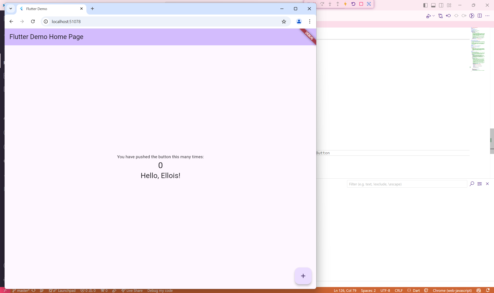
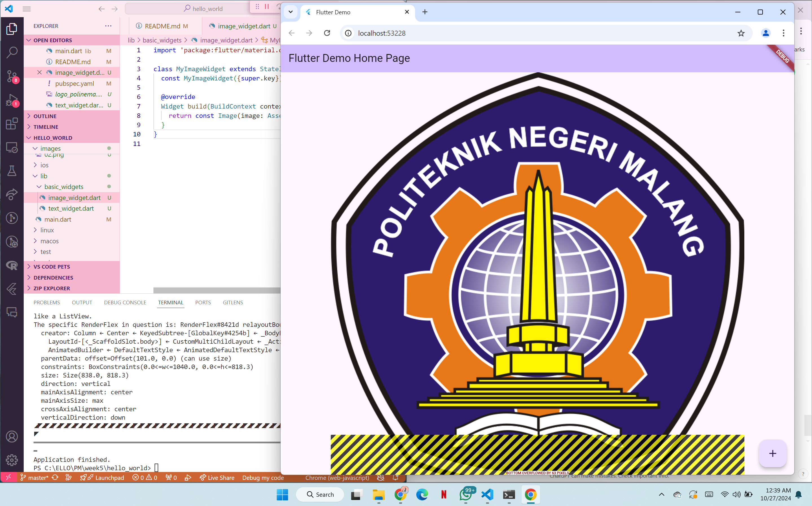
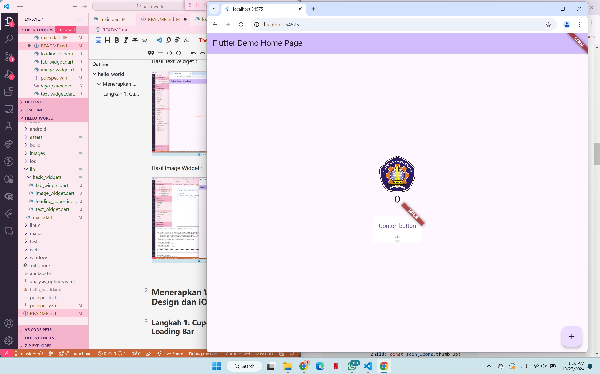
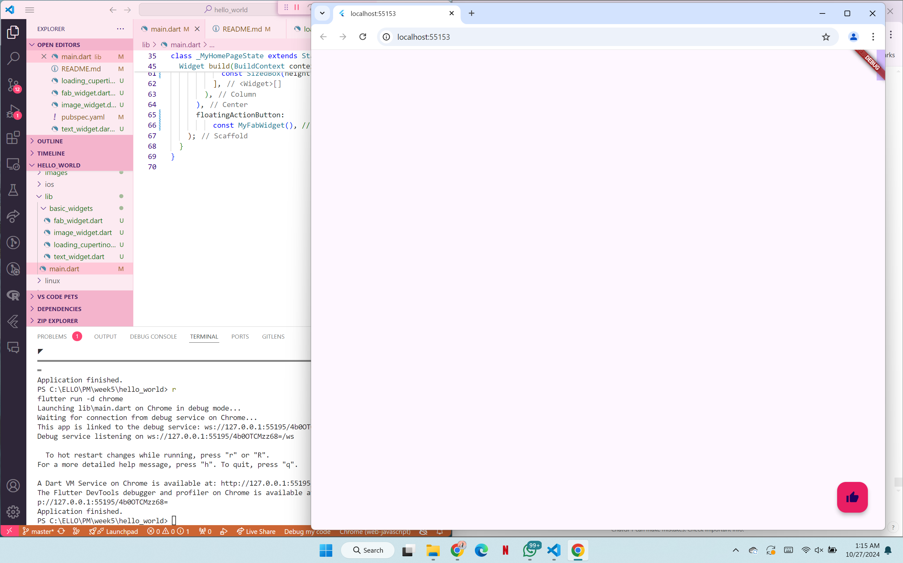
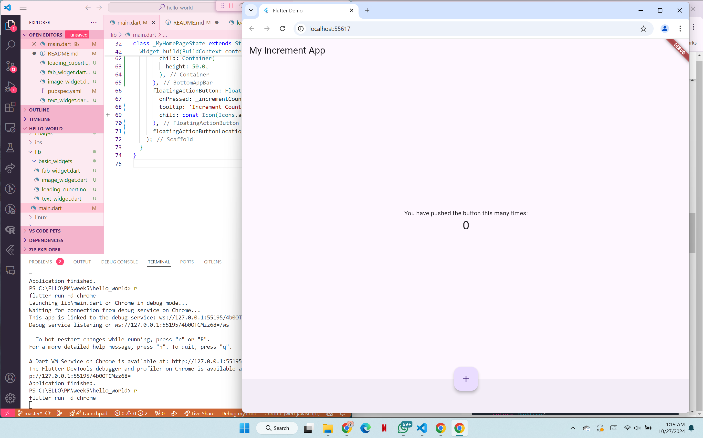
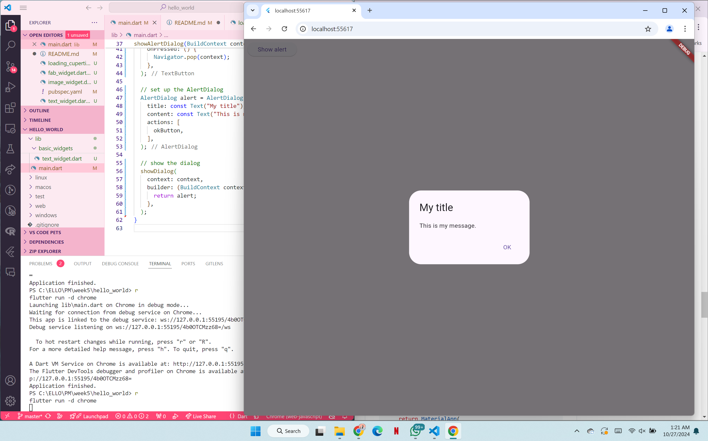
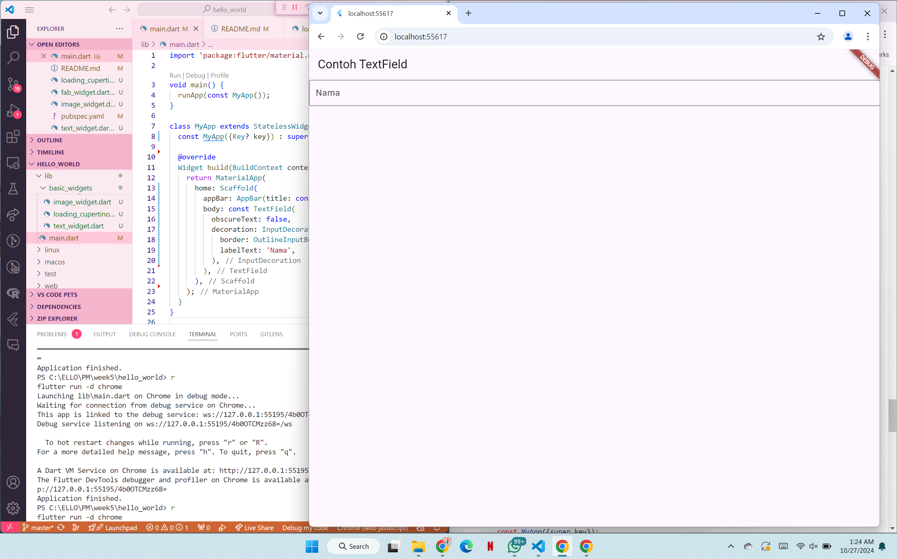
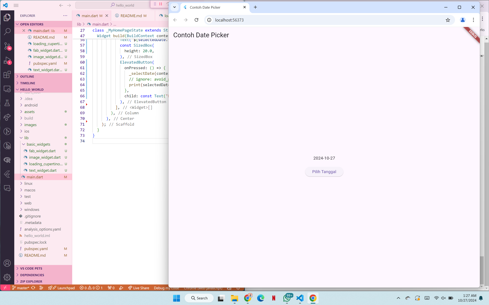
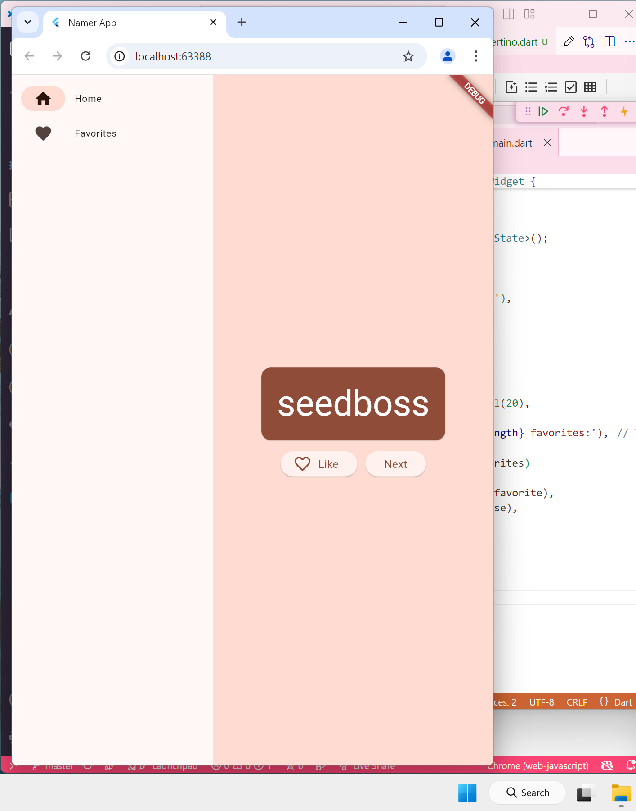
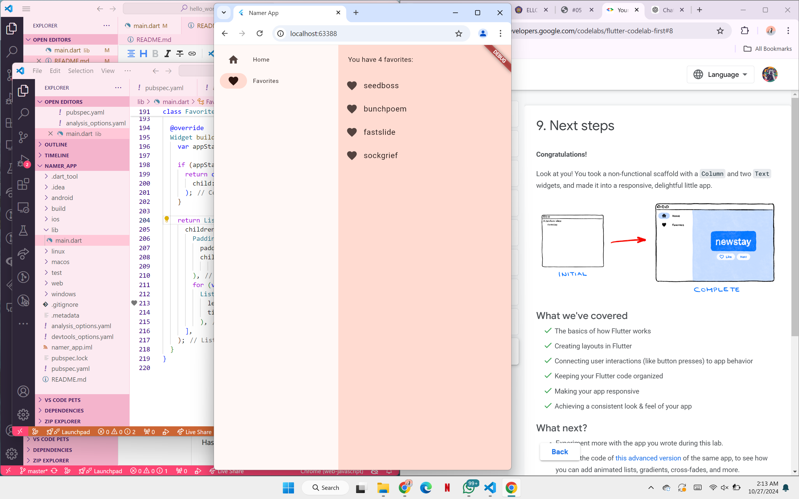

# hello_world

A new Flutter project.

# Praktikum 3 Langkah 12 :

# Hasil Text Widget :

# Hasil Image Widget :

## Menerapkan Widget Material Design dan iOS Cupertino

### Langkah 1: Cupertino Button dan Loading Bar

### Floating Action Button (FAB)

### Scaffold Widget

### Dialog Widget

### Input dan Selection Widget

### Date and Time Pickers

## Tugas Praktikum

Hasil:

